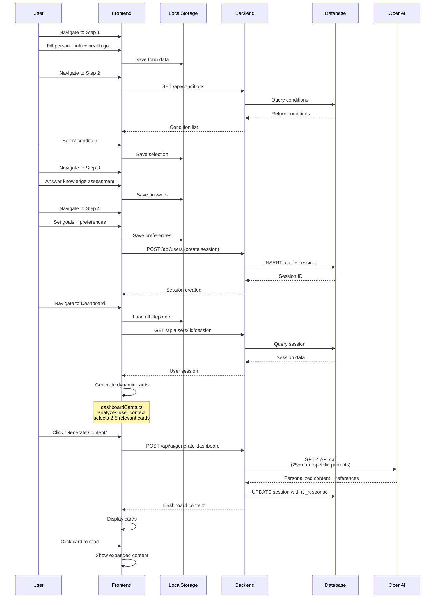
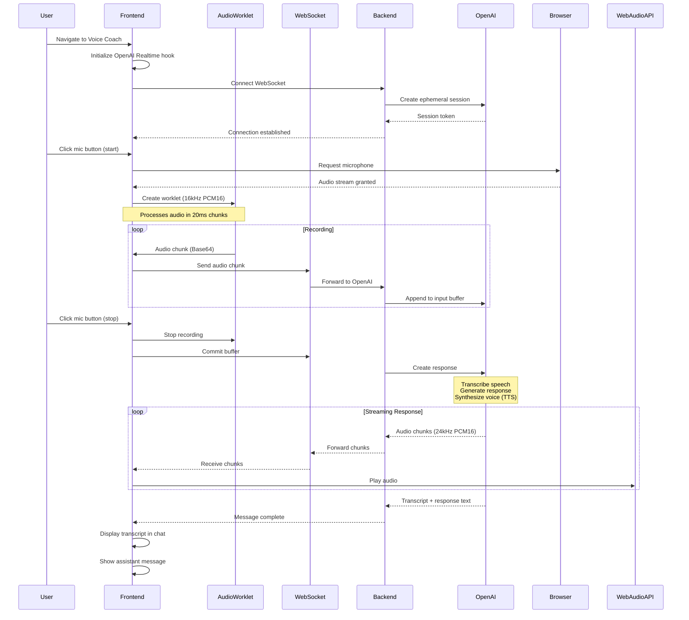
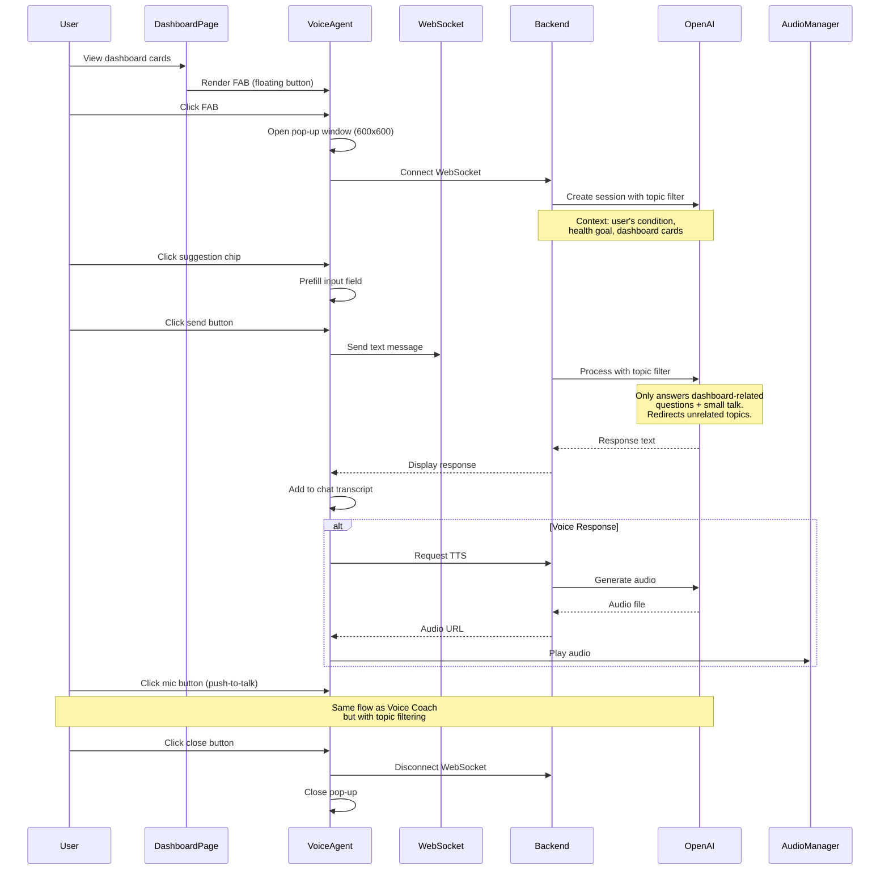
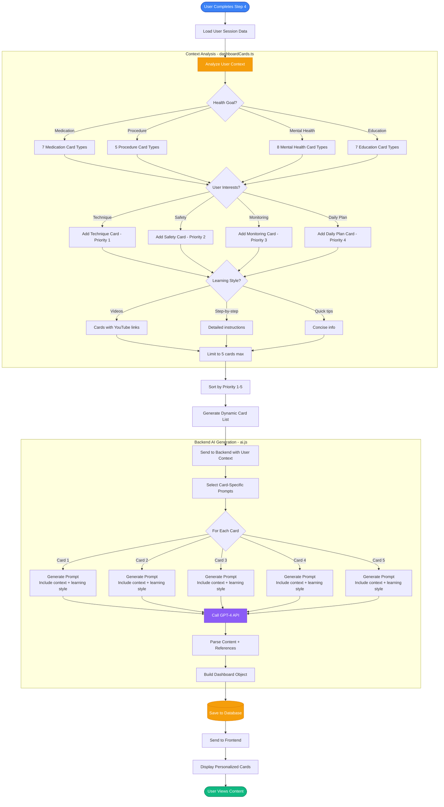
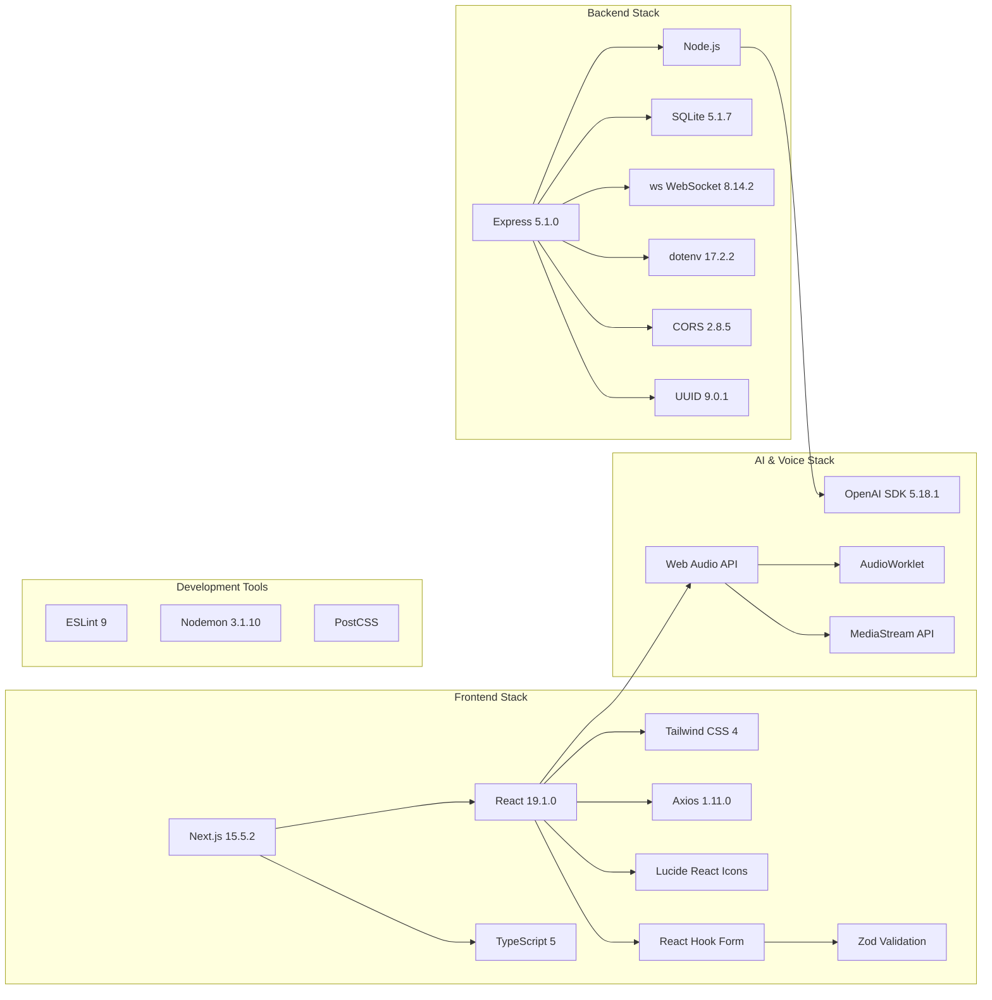
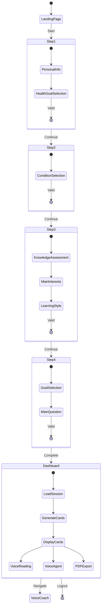
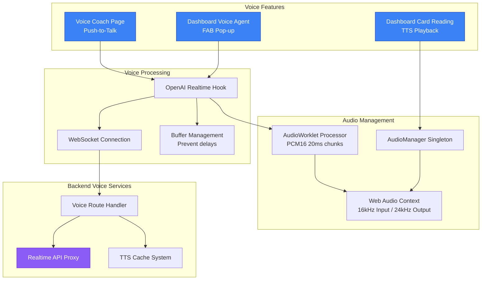

# AI-Based Patient Education Platform - System Architecture

## Complete Architecture Diagram

```mermaid
graph TB
    subgraph "User Interface Layer"
        User[👤 User/Patient]
        Browser[🌐 Web Browser]
        
        subgraph "Frontend - Next.js 15.5.2 TypeScript"
            subgraph "Pages App Router"
                LandingPage[Landing Page<br/>app/page.tsx]
                Step1Page[Step 1: Personal Info<br/>app/step-1/page.tsx]
                Step2Page[Step 2: Condition Selection<br/>app/step-2/page.tsx]
                Step3Page[Step 3: Knowledge Assessment<br/>app/step-3/page.tsx]
                Step4Page[Step 4: Goals & Preferences<br/>app/step-4/page.tsx]
                DashboardPage[Dashboard<br/>app/dashboard/page.tsx]
                VoiceCoachPage[Voice Coach<br/>app/voice-coach/page.tsx]
            end
            
            subgraph "UI Components"
                Step1Comp[Step1.tsx<br/>Personal form]
                Step2Comp[Step2.tsx<br/>Condition grid]
                Step3Comp[Step3.tsx<br/>Assessment form]
                Step4Comp[Step4.tsx<br/>Goals form]
                DashboardComp[Dashboard.tsx<br/>Dynamic cards]
                VoiceCoachComp[VoiceCoachInterface.tsx<br/>Push-to-talk UI]
                DashboardVoiceAgent[DashboardVoiceAgent.tsx<br/>FAB + Pop-up Voice Agent]
                AvatarLoop[AvatarLoop.tsx<br/>Animated avatar]
                BoldTextRenderer[BoldTextRenderer.tsx<br/>Formatted text]
            end
            
            subgraph "Business Logic Libraries"
                API[api.ts<br/>API client Axios]
                AudioManager[useAudioManager.ts<br/>Audio singleton]
                VoiceWebSocket[useVoiceWebSocket.ts<br/>WebSocket hook]
                OpenAIRealtime[useOpenAIRealtime.ts<br/>Realtime API hook]
                DashboardCards[dashboardCards.ts<br/>Dynamic card generator]
                Utils[utils.ts<br/>Helper functions]
            end
            
            subgraph "State Management"
                LocalStorage[localStorage<br/>Form persistence]
                ReactState[React Hooks<br/>Component state]
            end
        end
    end
    
    subgraph "Backend Layer - Node.js Express"
        subgraph "API Server - Express 5.1.0"
            ServerJS[server.js<br/>HTTP + WebSocket Server]
            
            subgraph "REST API Routes"
                UserRoutes[users.js<br/>/api/users]
                ConditionRoutes[conditions.js<br/>/api/conditions]
                MedicationRoutes[medications.js<br/>/api/medications]
                AIRoutes[ai.js<br/>/api/ai]
                VoiceRoutes[voice.js<br/>/api/voice]
            end
            
            subgraph "Services"
                OpenAIRealtimeService[OpenAIRealtimeService.js<br/>Realtime voice processing]
            end
            
            subgraph "WebSocket Server"
                WSS[WebSocket Server<br/>ws://localhost:6001/api/voice/chat]
            end
        end
        
        subgraph "Database Layer - SQLite"
            DB[(database.sqlite)]
            
            subgraph "Tables"
                UsersTable[users<br/>User profiles]
                SessionsTable[user_sessions<br/>Step data + AI response]
                ConditionsTable[conditions<br/>Available conditions]
                MedicationsTable[medications<br/>Medication list]
                VoiceSessionsTable[voice_sessions<br/>Voice chat sessions]
                VoiceTurnsTable[voice_turns<br/>Chat transcript]
                TTSCacheTable[tts_cache<br/>Audio cache]
                MiniKBTable[mini_kb<br/>Knowledge base]
                DashboardContentTable[dashboard_content<br/>Generated cards]
            end
        end
    end
    
    subgraph "External Services"
        OpenAI[OpenAI API]
        
        subgraph "OpenAI Features"
            GPT4[GPT-4<br/>Content generation]
            RealtimeAPI[Realtime API<br/>Voice-to-voice]
            TTSAPI[TTS API<br/>Text-to-speech]
        end
    end
    
    subgraph "Browser APIs"
        WebAudioAPI[Web Audio API<br/>Audio processing]
        AudioWorklet[AudioWorklet<br/>PCM16 processing]
        MediaDevices[MediaDevices API<br/>Microphone access]
    end
    
    %% User Journey Flow
    User -->|Navigates| Browser
    Browser -->|Loads| LandingPage
    LandingPage -->|Start| Step1Page
    Step1Page -->|Uses| Step1Comp
    Step1Page -->|Next| Step2Page
    Step2Page -->|Uses| Step2Comp
    Step2Page -->|Next| Step3Page
    Step3Page -->|Uses| Step3Comp
    Step3Page -->|Next| Step4Page
    Step4Page -->|Uses| Step4Comp
    Step4Page -->|Complete| DashboardPage
    DashboardPage -->|Uses| DashboardComp
    DashboardPage -->|Opens| DashboardVoiceAgent
    DashboardPage -->|Navigate to| VoiceCoachPage
    VoiceCoachPage -->|Uses| VoiceCoachComp
    
    %% Component Dependencies
    Step1Comp -->|Saves to| LocalStorage
    Step2Comp -->|Saves to| LocalStorage
    Step3Comp -->|Saves to| LocalStorage
    Step4Comp -->|Saves to| LocalStorage
    DashboardComp -->|Loads from| LocalStorage
    DashboardComp -->|Uses| DashboardCards
    DashboardComp -->|Plays audio| AudioManager
    DashboardComp -->|Voice Agent| DashboardVoiceAgent
    VoiceCoachComp -->|Uses| OpenAIRealtime
    VoiceCoachComp -->|Uses| AvatarLoop
    VoiceCoachComp -->|Uses| BoldTextRenderer
    DashboardVoiceAgent -->|Uses| OpenAIRealtime
    DashboardVoiceAgent -->|Uses| AudioManager
    
    %% API Communication
    Step1Comp -->|POST| API
    Step4Comp -->|POST| API
    DashboardComp -->|GET/POST| API
    API -->|HTTP REST| UserRoutes
    API -->|HTTP REST| ConditionRoutes
    API -->|HTTP REST| MedicationRoutes
    API -->|HTTP REST| AIRoutes
    API -->|HTTP REST| VoiceRoutes
    
    %% WebSocket Communication
    VoiceCoachComp -->|WebSocket| VoiceWebSocket
    DashboardVoiceAgent -->|WebSocket| VoiceWebSocket
    VoiceWebSocket -.->|wss://| WSS
    OpenAIRealtime -->|Uses| VoiceWebSocket
    
    %% Voice Processing Flow
    VoiceCoachComp -->|Captures| MediaDevices
    MediaDevices -->|Audio Stream| AudioWorklet
    AudioWorklet -->|PCM16| OpenAIRealtime
    OpenAIRealtime -->|Processes| WebAudioAPI
    WebAudioAPI -->|Plays| AudioManager
    
    %% Backend Routes to Database
    UserRoutes -->|CRUD| UsersTable
    UserRoutes -->|CRUD| SessionsTable
    ConditionRoutes -->|READ| ConditionsTable
    MedicationRoutes -->|READ| MedicationsTable
    AIRoutes -->|CRUD| SessionsTable
    AIRoutes -->|CRUD| DashboardContentTable
    VoiceRoutes -->|CRUD| VoiceSessionsTable
    VoiceRoutes -->|CRUD| VoiceTurnsTable
    VoiceRoutes -->|CRUD| TTSCacheTable
    
    %% Database Structure
    DB -->|Contains| UsersTable
    DB -->|Contains| SessionsTable
    DB -->|Contains| ConditionsTable
    DB -->|Contains| MedicationsTable
    DB -->|Contains| VoiceSessionsTable
    DB -->|Contains| VoiceTurnsTable
    DB -->|Contains| TTSCacheTable
    DB -->|Contains| MiniKBTable
    DB -->|Contains| DashboardContentTable
    
    %% OpenAI Integration
    AIRoutes -->|Generates| GPT4
    VoiceRoutes -->|TTS| TTSAPI
    WSS -->|Proxy| RealtimeAPI
    OpenAIRealtimeService -->|Uses| RealtimeAPI
    
    %% Server Initialization
    ServerJS -->|Initializes| DB
    ServerJS -->|Mounts| UserRoutes
    ServerJS -->|Mounts| ConditionRoutes
    ServerJS -->|Mounts| MedicationRoutes
    ServerJS -->|Mounts| AIRoutes
    ServerJS -->|Mounts| VoiceRoutes
    ServerJS -->|Creates| WSS
    
    %% Styling
    classDef frontend fill:#3b82f6,stroke:#1e40af,stroke-width:2px,color:#fff
    classDef backend fill:#10b981,stroke:#047857,stroke-width:2px,color:#fff
    classDef database fill:#f59e0b,stroke:#d97706,stroke-width:2px,color:#fff
    classDef external fill:#8b5cf6,stroke:#6d28d9,stroke-width:2px,color:#fff
    classDef browser fill:#ec4899,stroke:#be185d,stroke-width:2px,color:#fff
    
    class Step1Page,Step2Page,Step3Page,Step4Page,DashboardPage,VoiceCoachPage,Step1Comp,Step2Comp,Step3Comp,Step4Comp,DashboardComp,VoiceCoachComp,DashboardVoiceAgent,AvatarLoop,BoldTextRenderer,API,AudioManager,VoiceWebSocket,OpenAIRealtime,DashboardCards,Utils,LocalStorage,ReactState frontend
    class ServerJS,UserRoutes,ConditionRoutes,MedicationRoutes,AIRoutes,VoiceRoutes,OpenAIRealtimeService,WSS backend
    class DB,UsersTable,SessionsTable,ConditionsTable,MedicationsTable,VoiceSessionsTable,VoiceTurnsTable,TTSCacheTable,MiniKBTable,DashboardContentTable database
    class OpenAI,GPT4,RealtimeAPI,TTSAPI external
    class Browser,WebAudioAPI,AudioWorklet,MediaDevices browser
```

## Data Flow Diagrams

### 1. User Journey Flow (Steps 1-4 → Dashboard)

### 2. Voice Coach Interaction Flow (Push-to-Talk)

### 3. Dashboard Voice Agent Pop-up Flow

### 4. Dynamic Dashboard Content Generation Flow

## Technology Stack Details

## Database Schema

## Deployment Architecture

## Key Features Architecture

### Multi-Step Assessment Flow

### Voice System Architecture

## Security & Performance

```mermaid
graph TB
    subgraph "Security Measures"
        CORS[CORS Configuration<br/>Origin restrictions]
        APIKeyAuth[OpenAI API Key<br/>Environment variable]
        InputValidation[Input Validation<br/>Zod schemas]
        MedicalSafety[Medical Safety Filter<br/>Prevent medical advice]
    end
    
    subgraph "Performance Optimizations"
        TTSCaching[TTS Audio Caching<br/>Reduce API calls]
        LocalStorage[localStorage Persistence<br/>Form data]
        AudioSingleton[Audio Manager Singleton<br/>Prevent overlaps]
        DynamicCards[Dynamic Card Generation<br/>2-5 cards only]
    end
    
    subgraph "Error Handling"
        FrontendErrors[Frontend Error Boundaries]
        BackendErrors[Backend Error Middleware]
        Fallbacks[Fallback Systems<br/>Default cards]
        RetryLogic[Retry Logic<br/>Failed API calls]
    end
    
    CORS --> APIKeyAuth
    APIKeyAuth --> InputValidation
    InputValidation --> MedicalSafety
    
    TTSCaching --> LocalStorage
    LocalStorage --> AudioSingleton
    AudioSingleton --> DynamicCards
    
    FrontendErrors --> BackendErrors
    BackendErrors --> Fallbacks
    Fallbacks --> RetryLogic
    
    style MedicalSafety fill:#ef4444,stroke:#b91c1c,color:#fff
    style TTSCaching fill:#10b981,stroke:#047857,color:#fff
```

---

## Summary

This architecture diagram illustrates:

1. **Frontend Layer**: Next.js pages, React components, custom hooks, and state management
2. **Backend Layer**: Express API routes, WebSocket server, and business services
3. **Database Layer**: SQLite with 9 tables for comprehensive data storage
4. **External Services**: OpenAI GPT-4, Realtime API, and TTS integration
5. **Data Flow**: Complete user journey from assessment to personalized dashboard
6. **Voice System**: Push-to-talk voice coach and dashboard voice agent
7. **Security & Performance**: Caching, validation, error handling, and medical safety

The system uses a modern stack with React 19, Next.js 15, Express 5, and OpenAI's latest APIs to deliver personalized health education with voice interaction capabilities.

